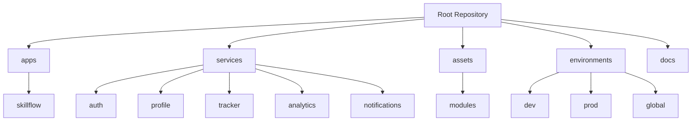

# Skillflow

[](https://flutter.dev/) [](https://golang.org/) [](https://www.rust-lang.org/) [](https://firebase.google.com/)

A modern skill tracking and learning management platform built with Flutter and microservices architecture, combining Go and Rust for optimal performance and maintainability.

## 📦 Repository Structure



### Applications
- **mobile/** - Flutter mobile application
- **web/** - Web dashboard (future expansion)

### Services
#### Go Services
- **auth/** - Authentication and authorization service
- **profile/** - User management and preferences

#### Rust Services
- **tracker/** - Activity and progress tracking
- **analytics/** - Data analysis and insights
- **notifications/** - Real-time notification system

### Prerequisites
- Git 2.x or higher
- Flutter 3.19.0 or higher
- Go 1.21 or higher
- Rust 1.75 or higher
- Docker & Docker Compose
- Firebase CLI
- Protocol Buffers compiler (protoc)

## 🚀 Getting Started

### Development Setup
```bash
# Clone the repository
git clone https://github.com/ranson21/skillflow.git
cd skillflow

# Initialize development environment
make setup

# Start development servers
make dev
```

## 🔧 Development Commands

### Core Commands
```bash
# Full development environment setup
make setup

# Start all services
make dev

# Clean all artifacts
make clean
```

## 🏗️ Infrastructure

### Docker Support
```bash
# Build all services
docker-compose build

# Run entire stack
docker-compose up
```

### Service Architecture
Each microservice follows a standardized structure:
- Clean architecture principles
- Health check endpoints
- Metrics collection
- Structured logging
- API documentation

## 📖 Documentation

### API Documentation
- Available at `/docs` endpoint for each service in development mode
- OpenAPI/Swagger specifications in `/docs/api`
- Postman collections in `/docs/postman`

### Architecture Documentation
- System design diagrams in `/docs/architecture`
- Service interaction patterns in `/docs/patterns`
- Development guidelines in `/docs/guidelines`

## 🔄 Update Strategy

1. **Regular Updates**
```bash
# Update all submodules to latest versions
git submodule update --remote
git add .
git commit -m "chore: update submodules to latest versions"
```

2. **Specific Module Updates**
```bash
cd assets/modules/tf-gcp-project
git checkout master
git pull
cd ../../..
git add assets/modules/tf-gcp-project
git commit -m "chore: update GCP project module"
```

## 🔒 Security

- Security scanning integrated into CI/CD pipeline
- Regular dependency updates and audits
- Secure configuration practices enforced
- Authentication and authorization at service boundaries

## 📄 License

This project is licensed under the MIT License - see the [LICENSE](LICENSE) file for details.

## 👥 Maintainers

For project related queries, contact [Abigail Ranson](mailto:abby@abbyranson.com)

## 🌟 Acknowledgments

- Flutter and Dart teams
- Go community
- Rust community
- Firebase team
